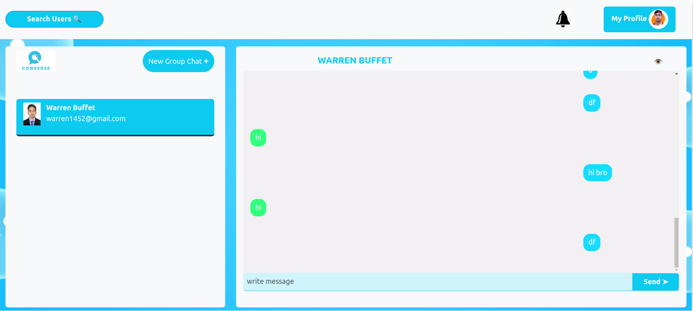
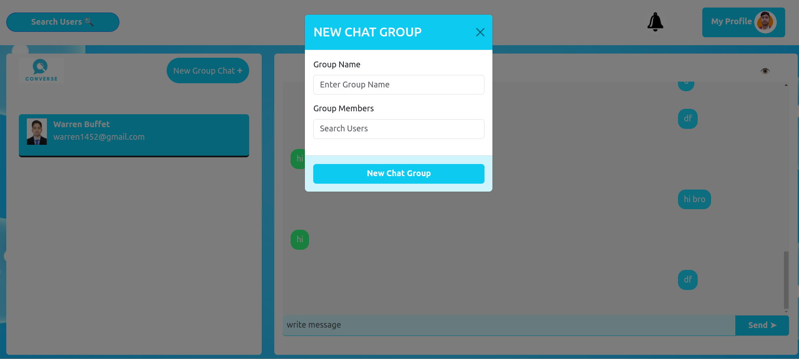
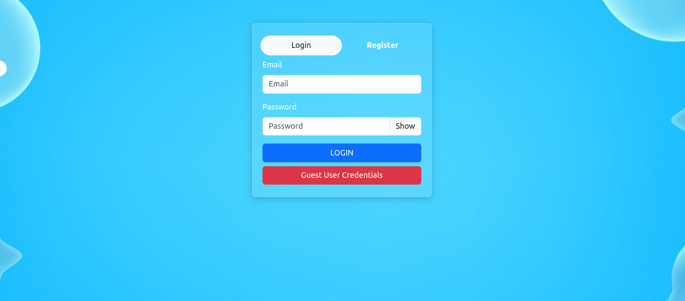
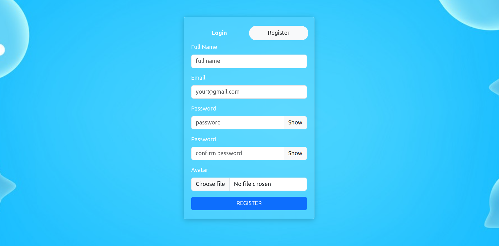

# CONVERSE
> CHAT APP

# MERN Stack Chat Application

## Overview

This is a chat application built using the MERN stack (MongoDB, Express.js, React.js, Node.js). It features user authentication (login, logout, register) and allows users to create both group and one-to-one chat conversations.

## Features

- **User Authentication**:
  - Register new users with email and password.
  - Login and logout functionality.
  
- **Chat Features**:
  - Create and join group chats.
  - Send and receive messages in real-time within the chat groups.
  - Create private, one-to-one chats between users.

- **Real-Time Communication**:
  - Utilizes **Socket.io** for real-time messaging between users and chat groups.

## Tech Stack

- **Frontend**: React.js
- **Backend**: Node.js with Express.js
- **Database**: MongoDB
- **Authentication**: JWT (JSON Web Tokens)
- **Real-time Communication**: Socket.io

 
> Chat Page  
> 

> **Create Group**  
> 

> LOGIN PAGE  
> 

> REGISTERATION PAGE  
> 
